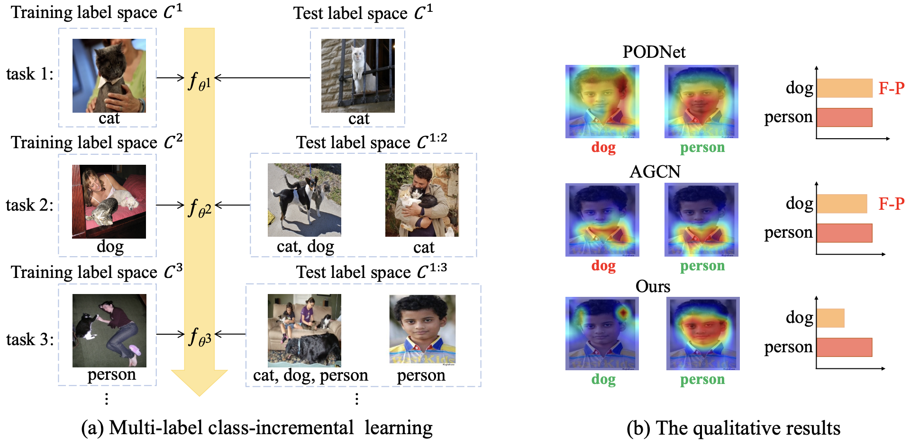

## Confidence Self-Calibration for Multi-Label Class-Incremental Learning

PyTorch code for the ECCV 2024 paper:  
Confidence Self-Calibration for Multi-Label Class-Incremental Learning  
Kaile Du, Yifan Zhou, Fan Lyu, Yuyang Li, Chen Lu, and Guangcan Liu  
The 18th European Conference on Computer Vision ECCV 2024  



# Setup

To set up the environment and install the necessary dependencies, follow the steps below:

1. Install Anaconda from [here](https://www.anaconda.com/distribution/).
2. Create a conda environment with Python 3.7. Example: conda create --name CSC python=3.7
3. Activate the conda environment: conda activate CSC
4. Install the required packages from `requirements.txt`: pip install -r requirements.txt


# Datasets and Pretrained Model

Ensure you have the following datasets and pretrained models available:

- **MS-COCO 2014**: Download the dataset and place it in `./src/datasets/MSCOCO`.
- **PASCAL VOC 2007**: Download the dataset and place it in `./src/datasets/VOC2007`.
- **TResNetM pretrained on ImageNet 21k**: Download the pretrained model from [here](https://miil-public-eu.oss-eu-central-1.aliyuncs.com/model-zoo/ASL/MS_COCO_TRresNet_M_224_81.8.pth) and rename it as `tresnet_m_224_21k.pth`. Place it in `./src/pretrained_tresnet`.
# Data Partitioning
./src/helper_functions/IncrementalDataset.py 
# Training with default setting
```
nohup python3 -u main.py > csc.log &
```

## Citation 
If you find our work useful for your research, please cite our work:  
```
@inproceedings{du2024confidence,
  title={Confidence Self-Calibration for Multi-Label Class-Incremental Learning},
  author={Du, Kaile and Zhou, Yifan and Lyu, Fan and Li, Yuyang and Lu, Chen and Liu, Guangcan},
  booktitle={Proceedings of the European Conference on Computer Vision},
  pages={234--252},
  year={2024}
}
```
